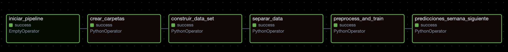

Documentacion de nuestro Dag

Para generar el Dag, se utilizan 5 archvos diferentes:

1. Create_folder.py: Este archivo contiene la funcion que nos permite crear una carpeta asociada a la fecha de ejecucion, que cintiene las subcarpetas; procesada, que almacenara la construccion de nuestro data set; la carpeta splits, que contendra los archivos de test y train; y la carpeta mlflows, que sera la que almacenara los datos de los runs de la fecha de ejecucion para poder analizar

2. preprocess.py: Esta carpeta contiene todas las funciones asociadas al preprocesamiento de los datos, tales como creacion de nuevas features, las pipelines, los escalados, etc

3. prepare_data.py: Esta carpeta contiene la funcion que nos permite generar el data set completo, vale decir, el producto cliente x producto x semana, y ademas nos genera un data set que consiste en usuario x producto x semana_siguiente, donde semana siguiente seria la semana que viene despues de la ultima de nuestros datos

4. split_data.py: Esta carpeta tiene la funcion que permite dividir los datos en train y test, respetando la temporalida de los mismos

5. train_model_final.py: Esta carpeta tiene la funcion que aplica el preprocesamiento a los datos, optimiza los parametros, y entrena el mejor modelo, guardando este mismo

6. generate_predictions.py: Es el archivo que tiene la funcion que permite generar predicciones al archvio de la semana siguiente a la ultima que se tiene registro

Ahora, respecto a las tareas de nuestro dag, vemos que tenemos 6:

1. Inicio: Tarea para dar inicio a nuestro Dag

2. crear_carpetas: Tarea que utilizando el archivo create_folder.py, crea las carpetas necesarias para la fecha de ejecucion, para poder almacenar los datos creados, ya seana data frames, o los archviso de mlflow

3. construir_data_set: Tarea que utilizando el archivo prepare_data, crea el data set final (el producto cartesiano) para poder comenzar el trabajo, y el data set asocaido a la semana siguiente despues de la ultima para predecir

4. separar_data: Tarea que utilizando el archivo split_data.py, separa nuestros datos del data set final en train y test, respetando temporalidad, para poder entrenar y evaluar nuestro modelo

5. entrenamiento: Tarea que a partir de de los archviso preprocess.py y train_model_final.py, preprocesa nuestros datos, luego optimiza los parametros para el modelo que elegimos, obteniendo asi el mejor modelo. Ademas, esta tarea guarda las pipelines necesarias para poder replicar el modelo posteriormente

6. prediccion: Tarea que usando el modelo y pipelines previas, genera predicciones para el data set creado en 2, referente a la semana posterior a la ultima

El flujo de nuestro Dag es el siguiente:

inicio  >> crear_carpetas >> construir_data_set >> separar_data >> entrenamiento >> prediccion

Y su representacion visual es la siguiente:

Si bien no implementamos la logica para re entrenamiento, la idea que tenemos es la siguiente:

1. Determinamos la cantidad de archivos referentes a transacciones en Data
2. Si existe uno solo, es que no hay datos nuevos, por lo que seguimos el flujo actual de entrenamiento
3. Si existen 2 o mas datos, se concatenan, es decir se agregan las filas
4. Posteriormente se sigue el flujo como esta
5. Esto, se haria a priori periodicamente, no segun drift, por lo que periodicamente haria la reivision si es que hay o no datos nuevos

Como comentario adicional, para la estructura completa de esta entrega, lo que realizamos fue un volumen entre la carpeta predicciones que encontramos en la carpeta airflow, con la que se tiene en el docker, lo que nos permite obtener en nuestro equipo las predicciones hechas. Ademas, hicismos un volumen entre la carpeta Modelos del docker, con la carpeta Modelos que se encuentra en Entrega_2\app\backend, para que esta pueda acceder a los modelos, y asi si se actualizan, solo habria que reiniciar el docker por los volumenes.

Como adicional, podran ver que en la carpeta predicciones se encuentra la prediccion realziada a travez de airflow para la primera semana del 2025

